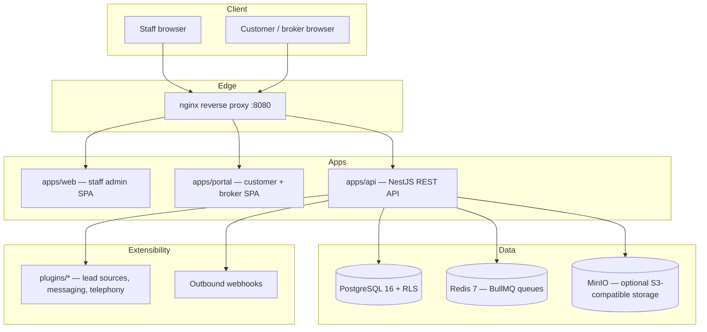

# OpenEstate

**Open-source, self-hostable CRM for Indian real estate — pre-sales, post-sales,
customer portal, broker portal — built to be adapted to other industries via
plugins, never by forking core code.**

OpenEstate is AGPL-3.0 licensed. Run it yourself with a single
`docker compose up`, like you would Zabbix or Wazuh.

> **Status: Phase 0 — scaffolding.** The core product (auth, inventory,
> pre-sales, post-sales ledger, brokers, portals, plugins) lands in the phases
> below. This README reflects what exists today plus the roadmap.

## Why OpenEstate

- **Self-hostable first.** No mandatory SaaS dependency. Optional integrations
  (SMS, email, lead portals) degrade gracefully when unconfigured.
- **Ledger, not mutation.** Financial records are append-only; corrections are
  reversal entries. Balances are always computed from the ledger, never stored
  as a mutable field.
- **Master-driven.** Tax rates, charge types, letter templates, inquiry
  sources — all admin-configurable. India ships as seed data, not code, so
  other countries can swap it out.
- **Multi-tenant by design.** Company → Project → Tower → Floor → Unit, with
  isolation enforced at the database layer (Postgres RLS), not just in
  application code.
- **Extensible, not forkable.** Custom fields, module flags, configurable
  terminology, a plugin API, and webhooks are core features — not something
  you patch in.

## Quickstart

### One-liner (Docker Compose)

```bash
curl -fsSL https://raw.githubusercontent.com/openestate/openestate/main/deploy/install.sh | bash
```

### From source

```bash
git clone https://github.com/openestate/openestate.git
cd openestate/deploy
./install.sh
```

Either way, `install.sh` checks for Docker, generates `deploy/.env` with
strong random secrets, builds and starts the stack, runs migrations and seed
data, then prints the URL to open.

**Prerequisites:** Docker + Docker Compose v2. For local development without
containers you'll also want Node.js 20+ and pnpm.

### Local development (no Docker for the app code)

```bash
pnpm install
pnpm --filter @openestate/db generate
pnpm dev
```

## Architecture



## Repository layout

```
apps/api        NestJS backend (controller → service → repository)
apps/web        Staff admin SPA (React + Vite + Tailwind)
apps/portal     Customer + broker portal SPA (role-routed)
packages/db     Prisma schema, migrations, seed data
packages/shared Types, zod schemas, constants shared FE/BE
packages/sdk    Generated TypeScript API client (from OpenAPI)
plugins/        First-party plugins (lead sources, messaging, telephony)
deploy/         docker-compose.yml, Dockerfiles, nginx conf, install.sh
docs/           Docusaurus site: install, admin, API, plugin dev
```

See [CLAUDE.md](CLAUDE.md) for the full set of architectural and security
rules this project is built against — multi-tenancy, the ledger model,
India-specific compliance handling, and the plugin boundary.

## Roadmap

| Phase | Scope |
| --- | --- |
| 0 | Scaffold, Docker Compose, CI *(this release)* |
| 1 | Auth, RBAC, multi-tenancy, masters framework, custom fields |
| 2 | Inventory: projects, towers, floors, units, pricing |
| 3 | Pre-sales: inquiries, assignment, follow-ups, funnel reports |
| 4 | Post-sales: bookings, payment plans, installments, receipts ledger |
| 5 | Brokers and commissions |
| 6 | Customer portal and broker portal |
| 7 | Plugin system and integrations |
| 8 | Hardening, backups, docs, release (v0.1.0) |

## Contributing

See [CONTRIBUTING.md](CONTRIBUTING.md) and [CODE_OF_CONDUCT.md](CODE_OF_CONDUCT.md).

## Security

See [SECURITY.md](SECURITY.md) for the responsible-disclosure policy.

## License

[AGPL-3.0-only](LICENSE).
