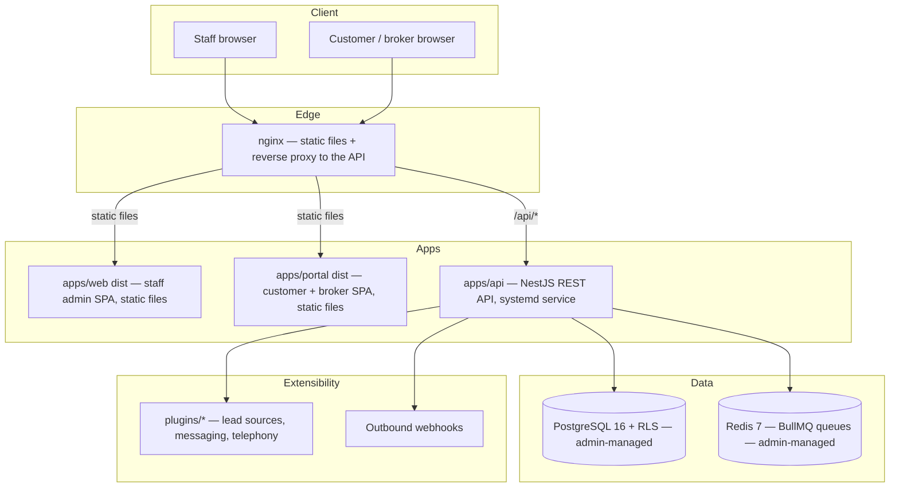

# OpenEstate

**Open-source, self-hostable CRM for Indian real estate — pre-sales, post-sales,
customer portal, broker portal — built to be adapted to other industries via
plugins, never by forking core code.**

OpenEstate is AGPL-3.0 licensed. Install it natively on your own server —
your own PostgreSQL and Redis, a systemd service, standard Linux paths —
like you would Zabbix or Wazuh, not a stack of containers you don't control.

> **Status: Phase 0 — scaffolding.** The core product (auth, inventory,
> pre-sales, post-sales ledger, brokers, portals, plugins) lands in the phases
> below. This README reflects what exists today plus the roadmap.

## Why OpenEstate

- **Self-hostable first.** No mandatory SaaS dependency. Optional integrations
  (SMS, email, lead portals) degrade gracefully when unconfigured.
- **Ledger, not mutation.** Financial records are append-only; corrections are
  reversal entries. Balances are always computed from the ledger, never stored
  as a mutable field.
- **Master-driven.** Tax rates, charge types, letter templates, inquiry
  sources — all admin-configurable. India ships as seed data, not code, so
  other countries can swap it out.
- **Multi-tenant by design.** Company → Project → Tower → Floor → Unit, with
  isolation enforced at the database layer (Postgres RLS), not just in
  application code.
- **Extensible, not forkable.** Custom fields, module flags, configurable
  terminology, a plugin API, and webhooks are core features — not something
  you patch in.

## Quickstart

### Native install (Ubuntu 22.04/24.04 — recommended)

Prerequisites: PostgreSQL 16, Redis, Node.js 20 (via NodeSource), and
nginx, installed and running (see the
[Installation Guide](docs/docs/installation.md#2-before-you-start--requirements)
for the exact commands). This project never installs or manages your
database or cache for you — it connects to what you already run.

```bash
git clone https://github.com/AshishGTH/openestate.git /opt/openestate-src
cd /opt/openestate-src/deploy/native
sudo ./install-native.sh --server-name crm.yourcompany.com
```

This creates a dedicated `openestate` system user, builds the app from
source, sets up the database roles, installs a systemd service
(`openestate-api`) and an nginx site, runs migrations + seed data, then
prints the URL to open plus a one-time random admin password. See the
[Installation Guide](docs/docs/installation.md) for the full SOP —
first-login checklist, backups, upgrades, and troubleshooting.

### Local development (dev servers, not a production install)

```bash
pnpm install
pnpm --filter @openestate/db generate
pnpm dev
```

**Portal click-through fixture.** To exercise the customer/broker portal
(`apps/portal`) from a known state instead of hand-building bookings,
documents, and tickets one at a time, run the demo seed first
(`pnpm seed`, creates the `demo-realty` company + admin login), then:

```bash
pnpm seed:portal-demo
```

This provisions — and, on every rerun, resets and recreates — a fixed
customer/broker fixture: a customer with a booking, a payment plan, a
receipt, a receipt + statement PDF, and an open support ticket; and a
broker with a booking, accrued commission, a `REQUESTED` NOC ready to
approve in the portal, and a commission statement PDF. It prints both
logins (phone + password) on completion. Safe to rerun any time you want
a clean slate — it deletes only its own fixed-identifier rows, never
your other data.

## Architecture



## Repository layout

```
apps/api        NestJS backend (controller → service → repository)
apps/web        Staff admin SPA (React + Vite + Tailwind)
apps/portal     Customer + broker portal SPA (role-routed)
packages/db     Prisma schema, migrations, seed data
packages/shared Types, zod schemas, constants shared FE/BE
packages/sdk    Generated TypeScript API client (from OpenAPI)
plugins/        First-party plugins (lead sources, messaging, telephony)
deploy/native/  Native install: install-native.sh, systemd unit, nginx
                config, backup/restore/upgrade/uninstall scripts
deploy/         docker-compose.yml, Dockerfiles — contributor test
                infrastructure only, see CONTRIBUTING.md
docs/           Docusaurus site: install, admin, API, plugin dev
```

See [CLAUDE.md](CLAUDE.md) for the full set of architectural and security
rules this project is built against — multi-tenancy, the ledger model,
India-specific compliance handling, and the plugin boundary.

## Roadmap

| Phase | Scope |
| --- | --- |
| 0 | Scaffold, Docker Compose, CI *(this release)* |
| 1 | Auth, RBAC, multi-tenancy, masters framework, custom fields |
| 2 | Inventory: projects, towers, floors, units, pricing |
| 3 | Pre-sales: inquiries, assignment, follow-ups, funnel reports |
| 4 | Post-sales: bookings, payment plans, installments, receipts ledger |
| 5 | Brokers and commissions |
| 6 | Customer portal and broker portal |
| 7 | Plugin system and integrations |
| 8 | Hardening, backups, docs, release (v0.1.0) |

## Contributing

See [CONTRIBUTING.md](CONTRIBUTING.md) and [CODE_OF_CONDUCT.md](CODE_OF_CONDUCT.md).

## Security

See [SECURITY.md](SECURITY.md) for the responsible-disclosure policy.

## License

[AGPL-3.0-only](LICENSE).
