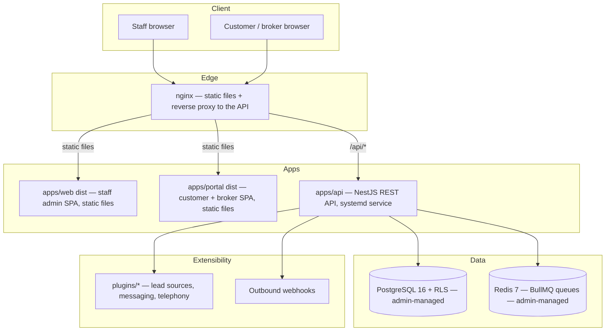

# OpenEstate

**Open-source, self-hostable CRM for Indian real estate — pre-sales, post-sales,
customer portal, broker portal — built to be adapted to other industries via
plugins, never by forking core code.**

OpenEstate is AGPL-3.0 licensed. Install it natively on your own server —
your own PostgreSQL and Redis, a systemd service, standard Linux paths —
like you would Zabbix or Wazuh, not a stack of containers you don't control.

> **Status: v0.3.0 — the core sales funnel works end to end for a first
> pilot, with a short list of known gaps worth reading before you rely on
> it.** Auth/RBAC, multi-tenancy, inventory, pre-sales, the post-sales
> ledger, brokers/commissions, both portals, plugins, webhooks, custom
> fields, and staff-published construction updates are all built and
> exercised end to end in a real browser against a real install. Before
> onboarding a real customer, read
> [Known gaps](docs/docs/features-and-usage.md#known-gaps-before-you-run-a-real-project-on-this) —
> a Unit-level custom field can be defined but never captured, and
> `Project.isActive` has no enforced effect anywhere yet.
> See [CHANGELOG.md](CHANGELOG.md) for what each release added and
> [docs/todo.md](docs/todo.md) for the full gap list.

## Why OpenEstate

- **Self-hostable first.** No mandatory SaaS dependency. Optional integrations
  (SMS, email, lead portals) degrade gracefully when unconfigured.
- **Ledger, not mutation.** Financial records are append-only; corrections are
  reversal entries. Balances are always computed from the ledger, never stored
  as a mutable field.
- **Master-driven.** Tax rates, charge types, letter templates, inquiry
  sources — all admin-configurable. India ships as seed data, not code, so
  other countries can swap it out.
- **Multi-tenant by design.** Company → Project → Tower → Floor → Unit, with
  isolation enforced at the database layer (Postgres RLS), not just in
  application code.
- **Extensible, not forkable.** Custom fields, module flags, configurable
  terminology, a plugin API, and webhooks are core features — not something
  you patch in.

## Quickstart

### Native install (Ubuntu — see "Verified on" below)

**Step 1 — install the prerequisites.** OpenEstate connects to
PostgreSQL, Redis and nginx that *you* own and manage; it never installs,
configures, upgrades or takes responsibility for them. That's a
deliberate design choice (the Zabbix/Wazuh model), which is why the
installer checks for them and refuses to run rather than installing them
behind your back. So you run this yourself, once, on a stock Ubuntu
server — nothing here is assumed to be present already:

```bash
# Base tools the install itself needs (a stock Ubuntu image has none of these)
sudo apt-get update
sudo apt-get install -y git curl build-essential python3

# Node.js 20 (NodeSource)
curl -fsSL https://deb.nodesource.com/setup_20.x | sudo -E bash -
sudo apt-get install -y nodejs

# PostgreSQL, Redis, nginx — YOUR services, yours to back up and upgrade.
# Ubuntu 22.04/24.04 ship PostgreSQL 16 under an explicit package name;
# 25.04+ ship 17 as the default `postgresql`. Either works.
sudo apt-get install -y postgresql-16 postgresql-client-16 || \
  sudo apt-get install -y postgresql postgresql-client
sudo apt-get install -y redis-server nginx
```

**Step 2 — install OpenEstate.** Note the `sudo` on the clone: `/opt` is
not writable by a normal user.

```bash
sudo git clone https://github.com/AshishGTH/openestate.git /opt/openestate-src
cd /opt/openestate-src/deploy/native
sudo ./install-native.sh --server-name crm.yourcompany.com
```

`--server-name` is what nginx matches on, so use a hostname that actually
resolves to this server. If you're just trying it out on a LAN box with no
DNS, the install is also reachable at the server's IP address directly.

**Verified on:** Ubuntu 25.10 (PostgreSQL 17) — a full clean-VM install
from these exact commands, ending in a working login and a completed
booking. Ubuntu 24.04 (PostgreSQL 16) is the documented target and is
exercised by CI's `native-install` job on `ubuntu-latest`, but has not been
hand-verified on a real 24.04 box recently. Other distributions are
unverified.

This creates a dedicated `openestate` system user, builds the app from
source, sets up the database roles, installs a systemd service
(`openestate-api`) and an nginx site, runs migrations + seed data, then
prints the URL to open plus a one-time random admin password. See the
[Installation Guide](docs/docs/installation.md) for the full SOP —
first-login checklist, backups, upgrades, and troubleshooting.

### Local development (dev servers, not a production install)

```bash
pnpm install
pnpm --filter @openestate/db generate
pnpm dev
```

**Portal click-through fixture.** To exercise the customer/broker portal
(`apps/portal`) from a known state instead of hand-building bookings,
documents, and tickets one at a time, run the demo seed first
(`pnpm seed`, creates the `demo-realty` company + admin login), then:

```bash
pnpm seed:portal-demo
```

This provisions — and, on every rerun, resets and recreates — a fixed
customer/broker fixture: a customer with a booking, a payment plan, a
receipt, a receipt + statement PDF, and an open support ticket; and a
broker with a booking, accrued commission, a `REQUESTED` NOC ready to
approve in the portal, and a commission statement PDF. It prints both
logins (phone + password) on completion. Safe to rerun any time you want
a clean slate — it deletes only its own fixed-identifier rows, never
your other data.

## Architecture



## Repository layout

```
apps/api        NestJS backend (controller → service → repository)
apps/web        Staff admin SPA (React + Vite + Tailwind)
apps/portal     Customer + broker portal SPA (role-routed)
packages/db     Prisma schema, migrations, seed data
packages/shared Types, zod schemas, constants shared FE/BE
packages/sdk    Generated TypeScript API client (from OpenAPI)
plugins/        First-party plugins (lead sources, messaging, telephony)
deploy/native/  Native install: install-native.sh, systemd unit, nginx
                config, backup/restore/upgrade/uninstall scripts
deploy/         docker-compose.yml, Dockerfiles — contributor test
                infrastructure only, see CONTRIBUTING.md
docs/           Docusaurus site: install, admin, API, plugin dev
```

See [CLAUDE.md](CLAUDE.md) for the full set of architectural and security
rules this project is built against — multi-tenancy, the ledger model,
India-specific compliance handling, and the plugin boundary.

## Roadmap

All phases below shipped as of v0.1.0; the project has followed semantic
versioning (v0.1.0 → v0.3.0 and counting) since. See
[CHANGELOG.md](CHANGELOG.md) for what each release since v0.1.0 added.

| Phase | Scope |
| --- | --- |
| 0 | Scaffold, Docker Compose, CI |
| 1 | Auth, RBAC, multi-tenancy, masters framework, custom fields |
| 2 | Inventory: projects, towers, floors, units, pricing |
| 3 | Pre-sales: inquiries, assignment, follow-ups, funnel reports |
| 4 | Post-sales: bookings, payment plans, installments, receipts ledger |
| 5 | Brokers and commissions |
| 6 | Customer portal and broker portal |
| 7 | Plugin system and integrations |
| 8 | Hardening, backups, docs, release (v0.1.0) |

## Contributing

See [CONTRIBUTING.md](CONTRIBUTING.md) and [CODE_OF_CONDUCT.md](CODE_OF_CONDUCT.md).

## Security

See [SECURITY.md](SECURITY.md) for the responsible-disclosure policy.

## License

[AGPL-3.0-only](LICENSE).
